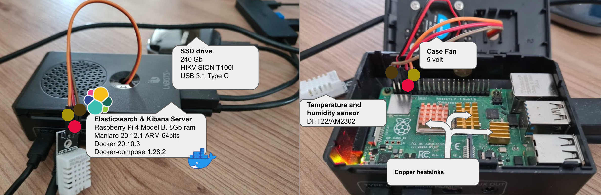

# Humidity and temperature sensor

This project aims to collect the data from a humidity and temperature sensor (DHT22) directly plugged on the GPIO input of a raspberrypi that will index those data into a local Elasticsearch in order to be able to monitor the data using a local instance of Kibana.

The elasticstack images used are available [here](https://gitlab.comwork.io/oss/elasticstack/elasticstack-arm) in opensource too.

This project is used by the [veggiepi](https://veggiepi.comwork.io) project.

## Table of content

[[_TOC_]]

## Git repository

* Main repo: https://gitlab.comwork.io/oss/veggiepi/humidity_and_temperature
* Github mirror backup: https://github.com/idrissneumann/rpi_humidity_and_temperature
* Gitlab mirror backup: https://gitlab.com/ineumann/rpi_humidity_and_temperature
* Bitbucket mirror backup: https://bitbucket.org/idrissneumann/humidity_and_temperature

## Docker image

The docker image of this sensor module is available here: https://hub.docker.com/repository/docker/comworkio/veggiepi-humidity-and-temperature

There is a ready-to-use [docker-compose.yml](./docker-compose.yml) file available on this git repo.

## Getting started

### Setup

This is the Raspberry Pi setup used by the maintener in order to build the ARM image (which is available on docker-hub) and to run it with a minimal ElasticStack which is also built for ARM (see [this repo](https://gitlab.comwork.io/oss/elasticstack/elasticstack-arm)).



### Run locally using docker-compose

Pick the [docker-compose.yml](./docker-compose.yml) file and follow the steps below.

#### Run elasticsearch

```shell
$ docker-compose up -d es01
```

Then wait until it answer on the 9200 port (you can check the logs with `docker logs veggie_es01`):

```shell
$ curl localhost:9200
{
  "name" : "elasticsearch",
  "cluster_name" : "elasticsearch",
  "cluster_uuid" : "v22OI4ILQZ-xfmlArtmHUw",
  "version" : {
    "number" : "7.10.2",
    "build_flavor" : "default",
    "build_type" : "tar",
    "build_hash" : "747e1cc71def077253878a59143c1f785afa92b9",
    "build_date" : "2021-01-13T00:42:12.435326Z",
    "build_snapshot" : false,
    "lucene_version" : "8.7.0",
    "minimum_wire_compatibility_version" : "6.8.0",
    "minimum_index_compatibility_version" : "6.0.0-beta1"
  },
  "tagline" : "You Know, for Search"
}
```

#### Run Kibana

```shell
$ docker-compose up -d kib01
```

Then wait until the UI of Kibana is loading on http://127.0.0.1:5601 (you can change the ip by your local network ip if you want to load the Kibana UI from another computer and you can check the logs with `docker logs veggie_kib01`).

#### Run the service

```shell
$ docker-compose up -d vhat01
```

Then you can check the logs with `docker logs veggie_vhat01` and check the data on Kibana!

You should be able to watch that kind of data:


### Override the configuration / use an Elasticsearch cluster on the cloud

Here the available environment variable you can override (if you want to choose an #Elasticsearch cluster on the cloud instead the local ARM-based containers for example):

* `VEGGIEPI_elastic_scheme`: the http scheme of your Elasticsearch cluster/instance (`http` or `https`)
* `VEGGIEPI_elastic_hosts`: list of Elasticsearch hostsname (`yourinstance.k8s.yourdomain.io` for example for an instance hosted on the cloud)
* `VEGGIEPI_elastic_port`: the http(s) port (generally `443` for an instance exposed on the cloud with https or `9200` for a local instance)
* `VEGGIEPI_elastic_subpath` (optional): if the Elasticsearch API is exposed on a particular subpath (`api` for example for a `/api` exposition of the endpoints)
* `VEGGIEPI_elastic_username` (optional): the username of your Elasticsearch cluster/instance if xpack authentication is enabled
* `VEGGIEPI_elastic_password` (optional): the password of your Elasticsearch cluster/instance if xpack authentication is enabled
* `VEGGIEPI_elastic_index_prefix` (optional): the indexes prefix (by default it will be `humidity_and_temperature`)
* `VEGGIEPI_elastic_wait_time` (optional): wait time in seconds each time the sensor is read (by default it's 60 seconds)
* `VEGGIEPI_elastic_pin` (optional): the GPIO data pin (by default it's the number 4)
* `VEGGIEPI_log_level` (optional): log level (`info`, `debug`, `warn`, `error`). Default is `info`

If you want to use an Elasticsearch cluster on the cloud, you can override those environment variables in a `.env` file on the same directory of your `docker-compose.yml` file then just have a simple `docker-compose` file like that:

```yaml
version: "3.3"

services:
  vhat01:
    image: comworkio/veggiepi-humidity-and-temperature:1.1
    container_name: veggie_vhat01
    privileged: true
```

Here you go, your raspberrypi will directly push the data on your #Elasticsearch on the cloud!
